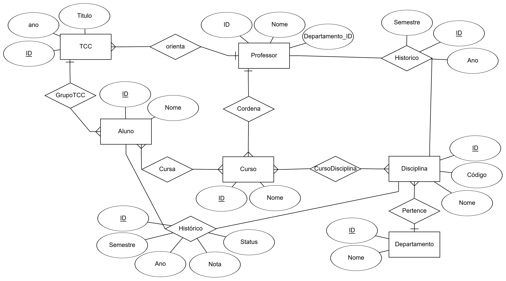
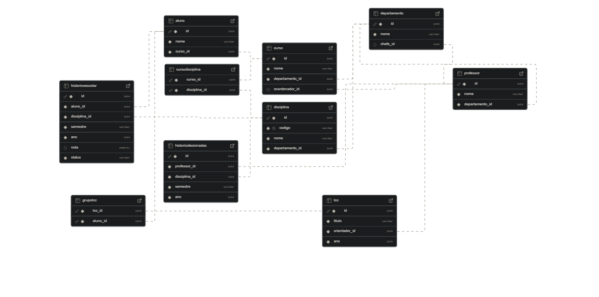

# CC5232-Banco-de-dados-para-uma-universidade


# Sistema Acadêmico — Projeto de Banco de Dados

## Integrantes do Grupo

- Vitor Monteiro Vianna — RA: 22.223.085-6 
- Hugo — RA: 
- Danilo — RA: 

## 📚 Descrição do Projeto

Este projeto simula um sistema acadêmico com foco na modelagem e manipulação de banco de dados. Ele contém:

- Modelo relacional e entidade-relacionamento
- Scripts SQL para criação das tabelas e execução de queries
- Scripts Python para inserção de dados fictícios e verificação de integridade dos dados

## 🚀 Como Executar o Projeto


1. **Crie e ative o ambiente virtual:**

   No Linux/macOS:
   python -m venv venv
   source venv/bin/activate

   No Windows:
   python -m venv venv
   venv\Scripts\activate

2. **Instale as dependências:**

   pip install -r requirements.txt

3. **Crie um arquivo `.env` na raiz do projeto** com as variáveis de conexão:

   Exemplo:
    ```
    user=postgres.ouxbwlvmnmyybfrbcgnq 
    password= senha_do_banco
    host=aws-0-sa-east-1.pooler.supabase.com
    port=6543
    dbname=postgres
    ```
4. **Execute os scripts:**

   - Para inserir dados fictícios:

     python script_insert_data_in_database.py

   - Para verificar a integridade dos dados:

     python script_verify_database_integrity.py

## 📊 Diagramas


